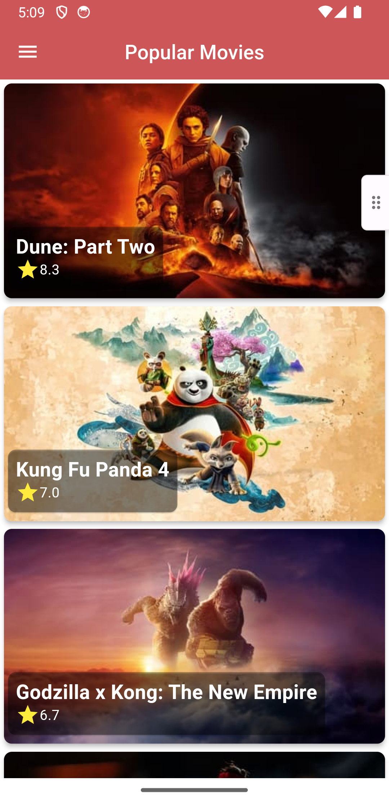
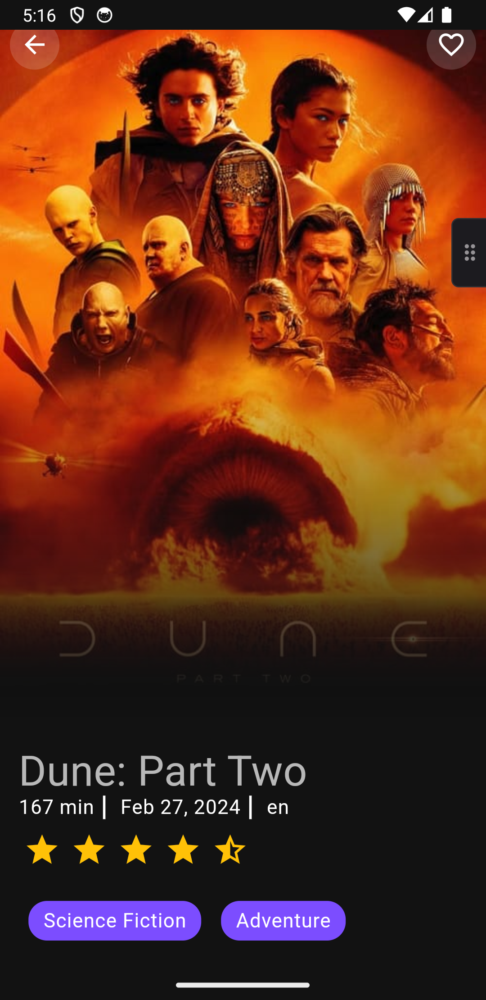
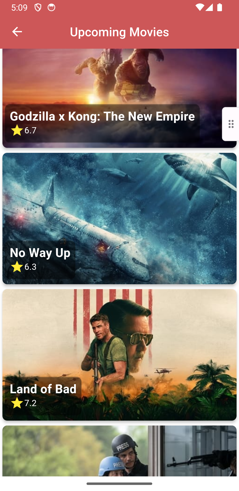
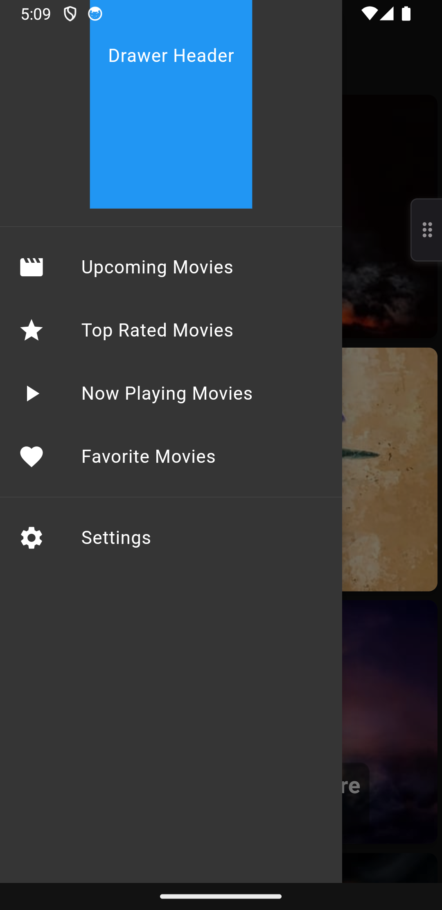
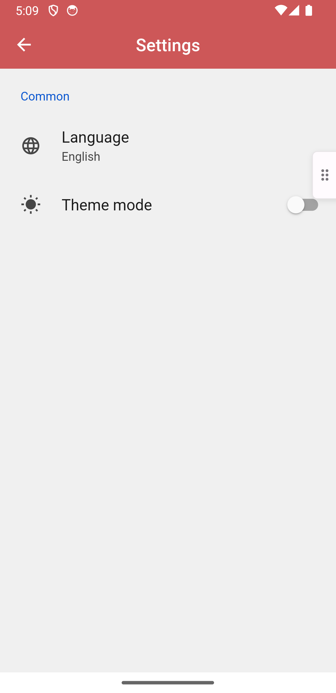
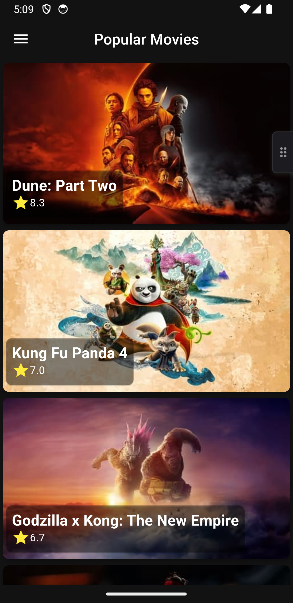
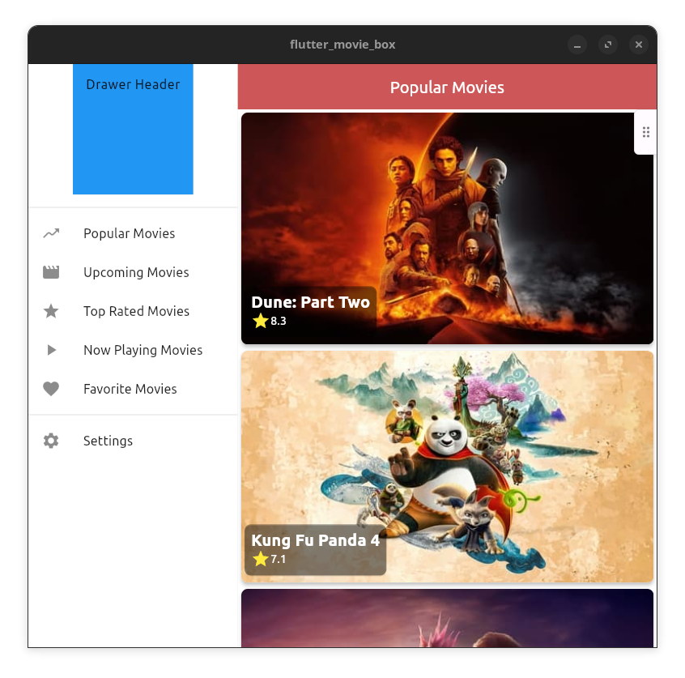

# Flutter Movie Box

A Flutter project that displays a list of movies from the [The Movie Database (TMDb) API](https://www.themoviedb.org/documentation/api).


## Features
- Display a list of movies
- View movie details
- Add movies to favorites
- View favorite movies
- Caching requests
- App theme switcher
- Responsive design for different screen sizes

## Architecture and Design Patterns Used
- [Clean Architecture](https://blog.cleancoder.com/uncle-bob/2012/08/13/the-clean-architecture.html)
- [BLoC (Business Logic Component) Pattern](https://www.flutterclutter.dev/flutter/basics/what-is-the-bloc-pattern/2021/2084/)
- [Repository Pattern](https://medium.com/@pererikbergman/repository-design-pattern-e28c0f3e4a30)
- [Dependency Injection](https://www.jamesshore.com/v2/blog/2006/dependency-injection-demystified)
- [Singleton Pattern](https://refactoring.guru/design-patterns/singleton)
- [Factory Pattern](https://refactoring.guru/design-patterns/factory-method)

## Technologies
- dartz - Functional programming in Dart
- flutter_bloc - State management
- bloc - Business logic components
- http - Network requests
- shared_preferences - Caching requests
- equatable - Value equality
- get_it - Dependency injection
- internet_connection_checker - Check internet connection
- flutter_rating_bar - Rating stars
- intl - Internationalization
- flex_color_scheme - App theme switcher
- adaptive_theme - App mode switcher
- setting_ui - App settings

## Getting Started
1. Clone the repository
```bash
git clone
```
2. Install dependencies
```bash
flutter pub get
```
3. Create a `.env` file in the root directory and add your TMDb API key
```bash
API_KEY=YOUR_API_KEY
```
4. Run the app
```bash
flutter run
```

## Screenshots
<!-- app_drawer.png             home_screen.png    settings_screen.png
home_screen_dark_mode.png  movie_details.png  upcoming_movies.png
 -->
| Home Screen | Movie Details | Upcoming Movies |
|:-----------:|:-------------:|:---------------:|
|  |  |  |

| App Drawer | Settings Screen | Home Screen (Dark Mode) |
|:----------:|:---------------:|:-----------------------:|
|  |  |  |
<!-- responsive_tablet.png -->
| Responsive Design (Tablet) |
|:--------------------------:|
|  |


## TODO:
- [ ] Add a search bar to search for movies
- [ ] Switch from using SharedPreferences to Hive/floor for caching and storing movies
- [x] Switch from using the http package to the dio package for network requests
- [ ] Localize the app in multiple languages
- [ ] Switching between multiple themes
- [x] Responsive design for different screen sizes 